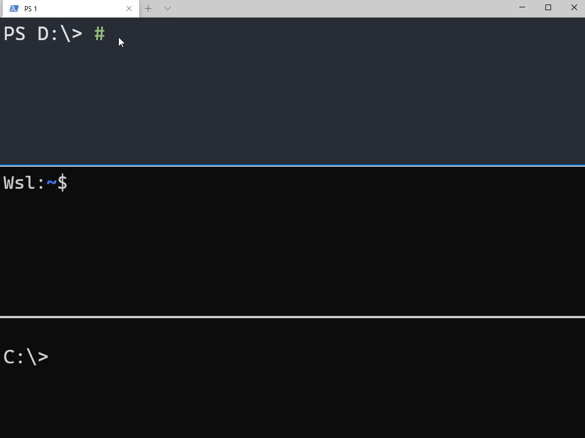

[](https://coveralls.io/github/NeilMacMullen/jumpfs?branch=main) [](https://gitter.im/jumpfs/community?utm_source=badge&utm_medium=badge&utm_campaign=pr-badge&utm_content=badge)

## Give a Star! :star:

If you like, or are using this project please give it a star - thanks!
<hr/>


## What's new?

### v1.2.0
- Implemented 'remove' functionality
- powershell and bash modules now better organised
- better handling for missing bookmarks
- If you pass an actual path instead of a bookmark, jumpfs now does the "right thing" in most cases.
- Bookmarks can be exposed via [virtual drive](doc/psdrive.md) (Powershell 7 only)
- It is now possible to bookmark Urls and shell commands

See [full revision history](doc/revisionHistory.md)
<hr/>

**jumpfs** is a simple cross-platform exe and collection of scripts that allow you bookmark locations in your file system, jump between them, or open them in explorer or VS Code.  You can also "bookmark" Urls and shell commands.

It's easiest to demonstrate with a picture..



## I want it! 

Great! You can get [prebuilt binaries](doc/download.md) or [build it yourself from source](doc/buildFromSource.md). 


Follow the instructions to
- [install for PowerShell](doc/powershell-installation.md)
- [install for WSL (Linux on Windows)](doc/wsl-installation.md)
- [install for native Linux](doc/linux-installation.md)
- [install for DOS/CMD](doc/cmd-installation.md)

## Basic use

The main commands are listed below but you can create your own quite easily by reading the [advanced usage](doc/advanced.md) guide.

Commands have both long function names and shorter aliases, shown in brackets below.  Aliases are defined at the top of *ps-jumpfs.psm1* and *bash-jumpfs.sh*

### jumpfs_mark (mark) - create a bookmark
**mark** can take up to 4 arguments.  The first is the name you want to use for the bookmark.  The remainder are *path*, *line-number* and *column-number*.  The latter two are useful when specifying a bookmark to a particular position within a file.

 - `mark name` creates a bookmark at the current working directory
 - `mark name path` creates a bookmark at the supplied folder or file
 - `mark name path 10 5` creates a bookmark with line number and column

*path* can be a file, folder, or URL starting *http:* or *https:*

jumpfs will silently overwrite an existing bookmark of the same name.  This is by design since bookmarks are meant to be lightweight and ephemeral.   If you don't like this behaviour, raise an issue and I'll consider adding a way to customise it. 

### jumpfs_go (go) - go to a bookmark
**go** only takes a single argument which is the name of the bookmark.  Note that if you *go* to a file, you will actually be taken to the folder that contains it.

### jumpfs_list (lst) - list bookmarks
If no arguments are supplied, **lst** will display all stored bookmarks.  If an argument is given, it is used to search within the bookmark names and paths and only those that match are returned.

### jumpfs_remove (rmbk) - remove bookmark
Removes a bookmark from the bookmark file

### jumpfs_code (codego) - open Visual Studio Code at the bookmark
If the bookmark supplied to **codego** is a file and has a line and column associated with it the file will be opened at that position.

### jumpfs_explorer_folder (x) - open Windows File Explorer at the bookmark
Opens Windows File Explorer at the location of the bookmark (or the containing folder if the bookmark is a file).

### jumpfs_explorer_run (xr) - pass a file to Windows explorer
Similar to double clicking on a file in Windows Explorer - if a folder, it's opened, if a file, then the extension will be used as a clue to perform the associated action. 

### jumpfs_value (bp) - get bookmark path
Gets the path of a bookmark so you can use it in a command.  For example:
```
ls (bp myplace)
```

### jumpfs_browse (url) - browse to a URL
*currently not implemented for Bash*
Runs explorer with the URL value of the bookmark 

### jumpfs_remember_last_command (markcmd)  
*currently not implemented for Bash*
Stores the last issued command as a bookmark 

### jumpfs_invoke (run)  
*currently not implemented for Bash*
Runs the bookmark (assuming it is a command that is suitable for the current shell)

### jumpfs_info - display version and other information
**jumpfs_info** will provide version and environment information. 

## Advanced use and custom scripts


How to use the PowerShell  [virtual drive](doc/psdrive.md)

Create custom functions and scripts by calling jumpfs directly: [jumpfs parameter reference](doc/jumpfs-exe.md)


## *"What's wrong with ZLocation?"* and other questions
Read the [faq](doc/faq.md) 

## Contributions
PRs are welcome.  Particularly to documentation and Linux-side scripts!  Please read the
[contributors guide](doc/contributions.md)

*Big-ticket* items it would be nice to get help with....

- Windows Shell extension
- VS Code extension
- a visual bookmark editor (possible as a VS Code extension)


